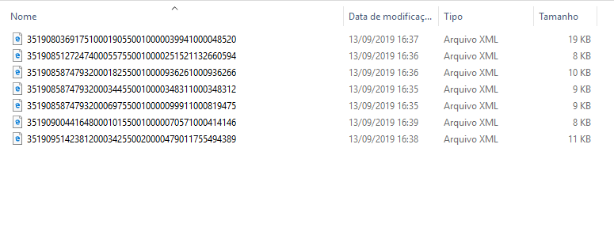
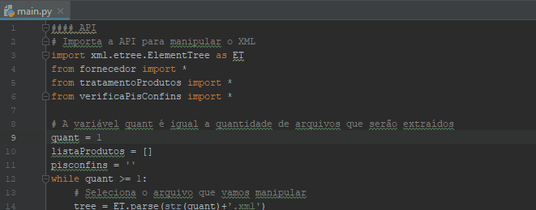
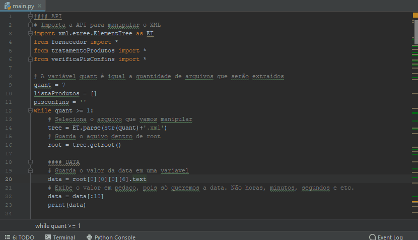
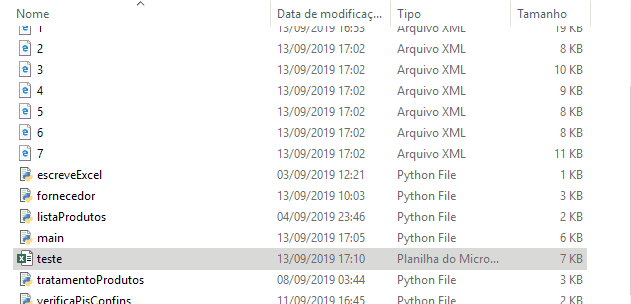

# ExtratorXMLtoExcel

Objetivo: Extrair da nota fiscal os dados que uma pessoa precisaria olhar, tratar o resultado e passar isso automaticamente para uma panilha em excel.

## Ferramentas:
- ElementTree XML
- OpenPyXl

## Informações importantes:
- A variável root corresponde ao nó principal da nossa árvore. No Exemplo A o nosso
root seria a tag nfeProc.
- Para pegar uma informação de alguma tag, precisamos acessar o nó correto. Para isso
é necessário especificar o caminho que vamos seguir. Por exemplo: root[a][b][c][n].text
Legenda: a = posição do primeiro nó, b = posição do segundo nó e assim respectivamente
Cada nó é identificado por um número. No Exemplo A o nó root[0][0][1].text seria a tag
emit.

## Exemplo A
```xml
<nfeProc versao="4.00">
   <NFe>
      <infNFe versao="4.00">
         <ide>
            Outros nós...
         </ide>
         <emit>
            Outros nós...
         </emit>
         <dest>
            Outros nós...
         </dest>
      </infNFe>
   </NFe>
</nfeProc>
```


## Step by Step

1. Faça o download dos arquivos XMLs.

2. Enumere os arquivos.


3. Faça a limpeza dos arquivos.


4. Abra o arquivo main.py e coloque a quantidade de xmls que serão extraídos.


5. Crie o Excel com o nome "teste" e de extensão .xlsx dentro da pasta fonte do projeto.

6. Execute o arquivo main.py


7. Vá na pasta do projeto e abra o arquivo teste.xlsx, para ver o resultado da extração.



